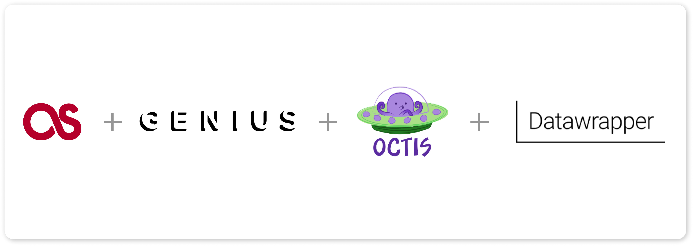

# Topic Modeling for Song Lyrics    

  

This project aims to perform topic modeling on song lyrics from Genius. The project consists of the following components:

- `data_collection.py`: Python script for collecting song lyrics from **Last FM API** and **Genius API**.
- `basic_cleaning.py`: Python script for some basic cleaning in the lyrics data.
- `modeler.py`: Python script for performing topic modeling by preprocessing lyrics data and visualizing the outputs.

## Data Collection

To collect the song lyrics data, the `data_collection.py` script uses the Last FM API to get the most popular tracks and then the Genius one to collect the lyrics. The collected data is stored in a JSON file in the `data` folder.

I decided to get 1000 thousands tracks for 17 genres.

## Data Cleaning

The collected data is hugely noisy and contain irrelevant characters. To have a basic cleaning of the lyrics data the `cleaning.py` script removes some special elements from each lyrics collected from Genius.

I decided to have the next preprocessing steps (removing stop words, punctation...) in the last python file.

## Topic Modeling

The `modeler.py` script defines a Python class TopicModeler with several methods for topic modeling, including preprocessing, training, and visualization, all performed with [OCTIS](https://github.com/MIND-Lab/OCTIS).

The class has the following attributes:

- `model`: an LDA model with 5 topics
- `preprocessor`: a Preprocessing object with some default settings
- `dataset`, `top_words_topics`, `topics`, `topic_word_matrix`, and `topic_document_matrix`: empty DataFrames and dictionaries for later use
- `diversity_score` and `coherence_score`: initially set to 0

The class has the following methods:

- __init__(): the constructor for the class, which initializes the attributes described above.
- **modelize(corpus_path)**: a method to train the LDA model on a given corpus, preprocesses the corpus, trains the LDA model, and stores the output. It also evaluates the topics using coherence and diversity scores.
- **visualize(genre)**: a method to visualize the top words and frequencies of the trained topics for a given genre.

## Data

The `data` folder contains the following type of files:

- `genre_data.json`: The raw song lyrics from a specific genre data collected from Genius.
- `genre_data.csv`: The preprocessed and cleaned lyrics data used for topic modeling for each genre.
